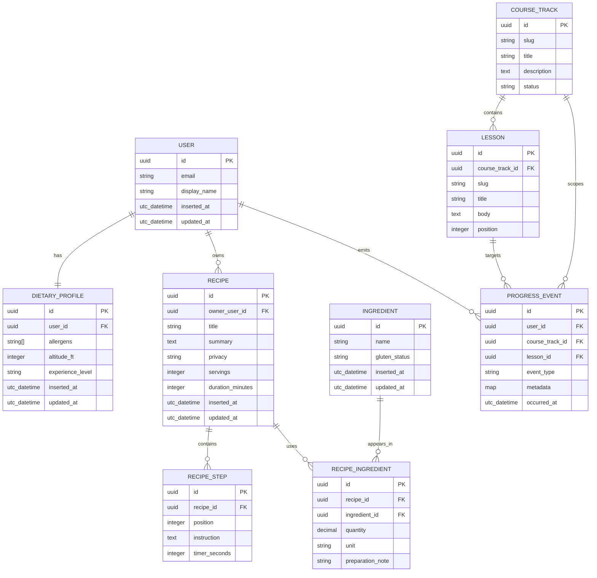
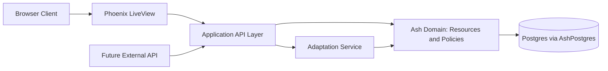

# NOO-14 Domain Model and Boundaries

This document defines the initial Ash domain model and architecture boundaries for guided lessons, recipes, user profiles, and progress tracking.

## Primary goals

- Support account-based cooking guidance for gluten-free users.
- Support public and private recipe ownership.
- Track course and lesson progress as append-only events.
- Isolate adaptation logic (allergy and altitude) behind explicit boundaries.

## Entity model

The initial entity set is represented below.

## Core invariants

- `User.email` is unique and immutable once verified.
- `DietaryProfile` is one-to-one with `User`.
- `Recipe.privacy` is one of `public`, `private`, or `unlisted`.
- `CourseTrack.status` is one of `draft`, `published`, or `archived`.
- `Ingredient.gluten_status` is one of `unknown`, `gluten_free`, `contains_gluten`, or `cross_contact_risk`.
- `DietaryProfile.experience_level` is one of `beginner`, `intermediate`, or `advanced`.
- `RecipeStep.position` and `Lesson.position` are unique within their parent and start at `1`.
- `RecipeIngredient` uniqueness is `(recipe_id, ingredient_id, preparation_note)`.
- `ProgressEvent` is append-only; updates and deletes are forbidden.
- `ProgressEvent.occurred_at` is set by server time, never trusted from client input.

## Ownership, privacy, and authorization model

- User profile data (`User`, `DietaryProfile`) is private to the account owner and privileged roles.
- Recipes:
  - `private`: readable and writable by owner only.
  - `unlisted`: readable by owner and direct-link clients, not listed publicly.
  - `public`: readable by anyone, writable by owner only.
- Course tracks and lessons are system-authored content; only admin/editor roles can write.
- Progress events are writable by the current user for their own identity only.

## Service boundaries

### 1) LiveView interaction layer

- Handles user interactions and rendering.
- Calls Ash actions through domain APIs.
- Never performs direct SQL queries.
- Never contains adaptation algorithm logic.

### 2) Ash domain layer

- Owns resources, actions, policies, and validations.
- Encodes invariants and authorization checks close to data.
- Exposes stable commands/queries for UI and external APIs.

### 3) Adaptation service boundary

- Separate domain service used by both recipe and lesson experiences.
- Inputs:
  - user dietary profile
  - recipe ingredients and steps
  - optional environment factors (altitude)
- Outputs:
  - ingredient substitutions
  - timing and hydration recommendations
  - warning set with rationale
- First version is synchronous in-process; boundary remains explicit to allow later extraction.

### 4) API layer boundary

- Internal API module wraps Ash actions for future mobile or partner clients.
- Returns stable DTO-style maps to avoid leaking internal resource internals.

## Boundary diagram

## Key data flows

### A) Personalized recipe view

1. LiveView requests recipe and current user profile.
2. Application API asks Ash for `Recipe` graph and `DietaryProfile`.
3. Application API calls adaptation service with recipe and profile.
4. LiveView receives normalized payload and renders adjusted recipe.

### B) Lesson progression

1. LiveView opens lesson in a course track.
2. User action sends `start` or `complete` event.
3. Application API writes append-only `ProgressEvent` via Ash action.
4. Dashboard queries aggregate progress from event history.

### C) Recipe publishing

1. Owner creates recipe in `private` mode.
2. Owner updates and validates ingredients/steps.
3. Owner transitions to `public` when quality checks pass.

## Integration points

- Authentication/authorization through current user scope in LiveView sessions.
- Persistence through `AshPostgres` and `GlutenFreeGuide.Repo`.
- External integrations (future): nutrition and allergen sources consumed through adapter modules that return normalized ingredient attributes.

## Open follow-ups

- Define exact Ash resource modules and action names.
- Decide whether `ProgressEvent` projections are materialized views or computed queries.
- Confirm `unlisted` discoverability semantics for search/indexing.
